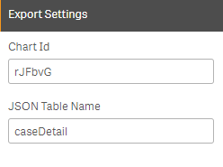
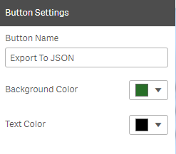

# QS-ExportToJSON
Qlik Sense Extension to Export data to json.

Note : If you are exporting huge volume of data then it will take some time.

Before clicking on export button, make sure to reduce the number of records to export. 

This extension works on client side and it doesn't require any backend server. 

## Export Settings

* Chart Id : Id for the chart to export (Use single configurator to get the chart id)
* JSON Table Name : Root element of the json and also it will be used for export file name

## Button Settings

* Button Name : Button Name
* Background Color : Background Color 
* Text Color : Text Color

(color picker api has a bug, hence it is not showing selected color in property but it does reflects in button)

